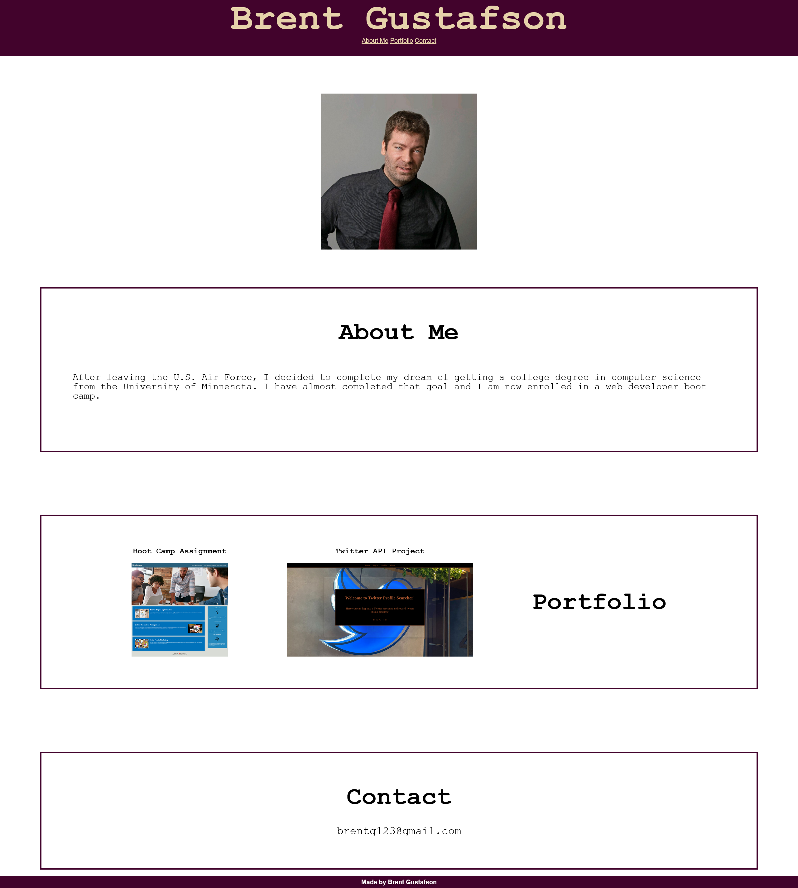

# 02-my-portfolio

## Description

This web app is designed to be a sample web developer portfolio. This was created to show off some of the projects that I have made. This should give people an idea of my ablity to create web pages. By creating this I learned how to better use flexbox in my web apps.

## Usage

The portfolio site has links to my web app projects. Just click on the screenshot pictures in the portfolio section.

To add a screenshot, create an `assets/images` folder in your repository and upload your screenshot to it. Then, using the relative filepath, add it to your README using the following syntax:

## License

MIT License